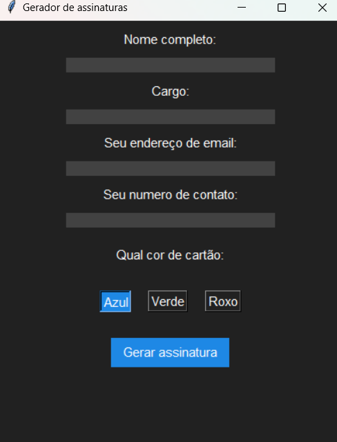

# Gerador-de-assinatura
Gerador de assinaturas de email feito em Python, que permite criar assinaturas personalizadas. 
# Gerador de assinaturas

Este é um programa que permite gerar uma assinatura com informações pessoais, como nome, cargo, e-mail e telefone, e escolher a cor do cartão da assinatura.

## Bibliotecas utilizadas

O programa utiliza as seguintes bibliotecas:
- `tkinter` para a interface gráfica
- `messagebox` da biblioteca `tkinter` para exibir mensagens de erro
- `PIL` para manipulação de imagens
- `os` para salvar a imagem gerada
- `webcolors` para conversão de nome de cores em valores RGB

## Funções utilizadas

### `create_signature(cargo, color_name, name, email, phone)`

Esta função cria uma imagem com as informações fornecidas pelo usuário e a cor escolhida.

Argumentos:
- `cargo`: cargo do usuário (string)
- `color_name`: nome da cor escolhida para o cartão (string)
- `name`: nome do usuário (string)
- `email`: endereço de e-mail do usuário (string)
- `phone`: número de telefone do usuário (string)

Retorno:
- A imagem da assinatura (objeto da classe `PIL.Image.Image`)

### `create_signature_and_save()`

Esta função é executada quando o botão "Gerar assinatura" é clicado. Ela obtém as informações fornecidas pelo usuário, verifica se todos os campos foram preenchidos e chama a função `create_signature` para criar a imagem da assinatura. Em seguida, a imagem é salva em um arquivo PNG e a janela é fechada.

## Interface gráfica

A interface gráfica consiste em uma janela com os seguintes elementos:

- Campos de entrada:
  - Nome completo
  - Cargo
  - E-mail
  - Número de telefone
- Botão de seleção de cor do cartão (Azul, Verde ou Roxo)
- Botão "Gerar assinatura"

## Uso

Para executar o programa, basta rodar o arquivo exe. Python. A interface gráfica será aberta e o usuário poderá preencher os campos e selecionar a cor do cartão. Ao clicar no botão "Gerar assinatura", a imagem da assinatura será gerada e salva em um arquivo PNG na pasta Downloads do usuário.

